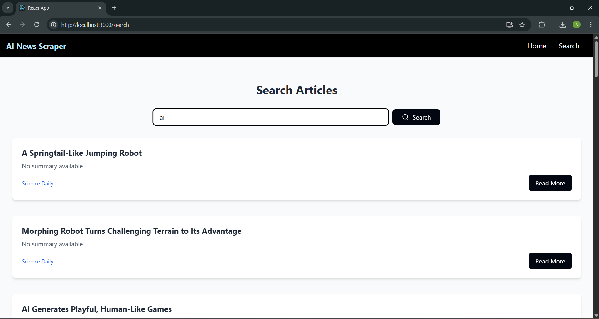
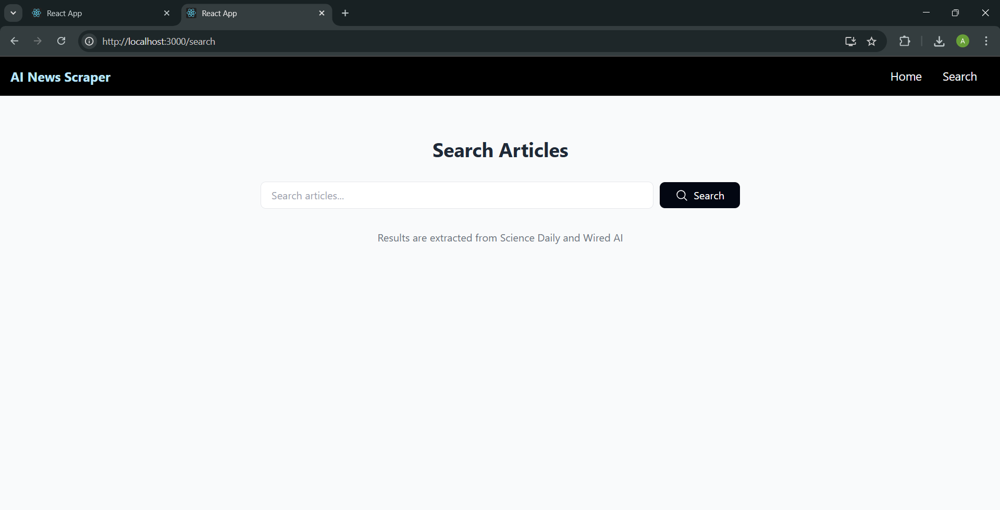

# AI News Scraper Application

A full-stack application that scrapes AI-related articles from multiple sources and provides search functionality.




## Features

- **Backend**:
  - FastAPI web scraper for multiple news sources
  - SQLite database storage
  - REST API endpoints
- **Frontend**:
  - React.js with TailwindCSS
  - Article search functionality
  - Responsive design

## Project Structure

```
ai-news-scraper/
├── backend/               # (Your existing backend structure)
└── frontend/              # React application
    ├── public/            # Static assets
    │   ├── index.html     # Main HTML template
    │   ├── favicon.ico    # Favicon
    │   └── robots.txt     # SEO file
    ├── src/
    │   ├── assets/        # Static assets (images, fonts)
    │   │   └── images/    # Project images
    │   ├── components/    # Reusable UI components
    │   │   ├── ArticleCard.jsx
    │   │   ├── Navbar.jsx
    │   │   ├── SearchBar.jsx
    │   │   └── index.js   # Component exports
    │   ├── pages/         # Page components
    │   │   ├── Home.jsx
    │   │   ├── Search.jsx
    │   │   └── index.js   # Page exports
    │   ├── services/      # API/services
    │   │   └── api.js     # Axios configurations
    │   ├── styles/        # Custom styles
    │   │   └── globals.css # Additional CSS
    │   ├── App.jsx        # Main app component
    │   ├── App.test.jsx   # Test file
    │   ├── index.jsx      # Application entry point
    │   └── setupTests.js  # Jest setup
    ├── .env.development   # Frontend env vars
    ├── .eslintrc.json     # ESLint config
    ├── .gitignore         # Frontend specific ignores
    ├── package.json       # Project manifest
    ├── package-lock.json  # Dependency lockfile
    ├── postcss.config.js  # PostCSS config
    ├── README.md          # Frontend docs
    └── tailwind.config.js # Tailwind config
```

## Setup Instructions

### Backend Setup

1. Navigate to backend folder:

   ```bash
   cd backend
   ```

2. Create and activate virtual environment:

   ```bash
   python -m venv venv
   # Linux/Mac:
   source venv/bin/activate
   # Windows:
   venv\Scripts\activate
   ```

3. Install dependencies:

   ```bash
   pip install -r requirements.txt
   ```

4. Set up environment variables:

   ```bash
   cp .env.example .env
   # Edit .env file with your configurations
   ```

5. Run the backend server:
   ```bash
   uvicorn app.main:app --reload
   ```

### Frontend Setup

1. Navigate to frontend folder:

   ```bash
   cd frontend
   ```

2. Install dependencies:

   ```bash
   npm install
   ```

3. Start development server:
   ```bash
   npm start
   ```

## API Endpoints

| Endpoint              | Method | Description          |
| --------------------- | ------ | -------------------- |
| `/articles`           | GET    | Get all articles     |
| `/search?q={query}`   | GET    | Search articles      |
| `/scrape/{site_name}` | POST   | Scrape specific site |

Example requests:

```bash
# Get all articles
curl http://localhost:8000/articles

# Search for "GPT"
curl http://localhost:8000/search?q=GPT

# Scrape TechCrunch
curl -X POST http://localhost:8000/scrape/techcrunch
```

## Deployment

### Backend Deployment (Heroku Example)

1. Create a `Procfile` in backend folder:

   ```
   web: uvicorn app.main:app --host=0.0.0.0 --port=${PORT:-8000}
   ```

2. Push to Heroku:
   ```bash
   heroku create
   git push heroku main
   ```

### Frontend Deployment (Vercel Example)

1. Install Vercel CLI:

   ```bash
   npm install -g vercel
   ```

2. Deploy:
   ```bash
   cd frontend
   vercel
   ```

## Environment Variables

Backend `.env` file:

```
DATABASE_URL=sqlite:///./articles.db
SCRAPE_INTERVAL=3600  # in seconds
```
